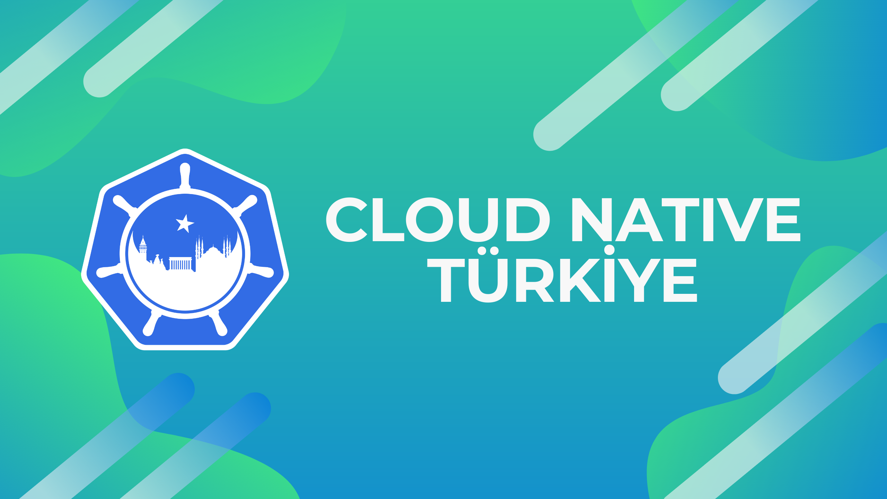

# TGICN

## Welcome to Cloud Native Türkiye & Kubernetes Community

Official repository for TGICN (Thank God it's Cloud Native)!

🌐 You can reach our [social media accounts](https://linktr.ee/cloudnative) to get more information about us.

📺 You can watch our live events on [YouTube channel](https://www.youtube.com/channel/UCnCjRoEqnXSXuOWXlMmVzdA).

📅 Follow our [Meetup](https://www.meetup.com/tr-TR/cloud-native-turkiye-kubernetes/) and [Kommunity](https://kommunity.com/cloud-native-turkiye-kubernetes/) pages to get more information about virtual and physical events.

🐦 Follow us on [Twitter](https://twitter.com/cloudnativetr) to get the latest news.

💼 Follow us on [LinkedIn](https://www.linkedin.com/company/cloudnativetr) to get the latest posts.

🎥 Follow us on [Twitch](https://www.twitch.tv/cloudnativetr) to watch our live events.

📫 You can reach us via [sending an email](mailto:cloudnativetr@gmail.com) or [Twitter](https://twitter.com/cloudnativetr).

## Suggest an episode

If you have an idea for TGICN, please [open an issue in the TGICN issue tracker](https://github.com/cloudnativetr/tgicn/issues/new).
We pick the episodes we deem appropriate for what is going on in the community.
We also try to pick episodes that are interesting to the community.
If we choose your suggestion, we will return to your original work here!
