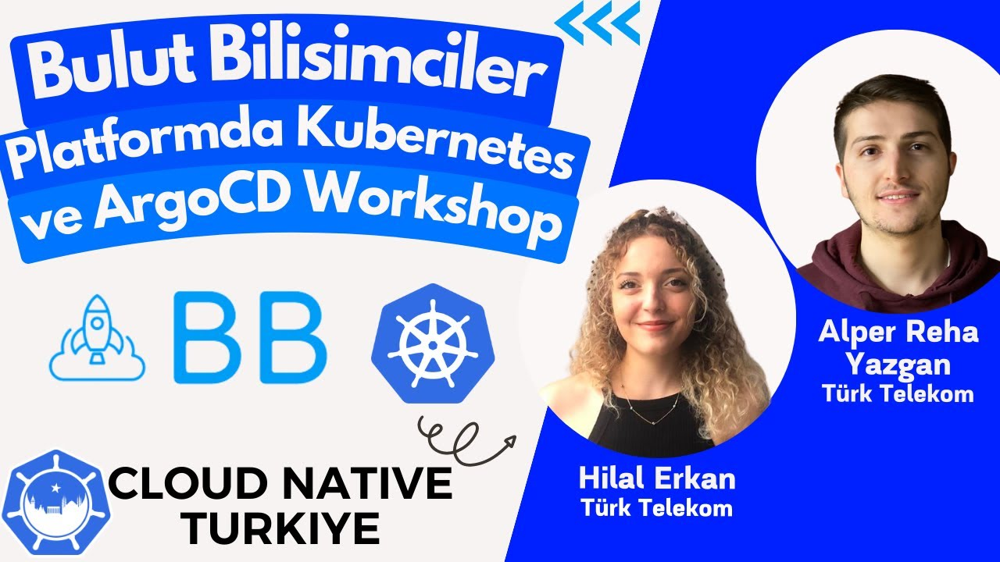

# Managing ArgoCD Application Deployment Lifecycle with Bulut Bilisimciler Platform

## Description

### Speaker

- [Alper Reha Yazgan](https://www.linkedin.com/in/alperreha/): Has been working as a Full Stack Developer at Türk Telekom for over a year. He is actively developing on Go language and Node.js (React). Involved in the management of back-end and front-end processes on the Bulut Bilisimciler platform.
- [Hilal Erkan](https://www.linkedin.com/in/hilal-erkan/): Has been working as a DevOps Engineer at Türk Telekom for over a year. Actively develops Serverless and GitOps processes. Takes part in content and infrastructure operations on the Bulut Bilisimciler platform.

- Event Date: 18/04/2023

- You can watch the episode record on [YouTube](https://www.youtube.com/live/zjfcn2BfCFo)

### Summary

In this session, we will examine the free hands-on lab environments provided by the Bulut Bilisimciler platform and deploy the Go application by installing the Kubernetes Cluster using the servers allocated through the platform and installing the ArgoCD tool. We will cover the whole process from start to finish and bring it to life with a practical demo. 🔥

## Table of Contents

### Live Stream Recording

### Live Stream Materials

- You can find the slideshow document [here](bulut-bilisimciler-2023-04-18-cncf.pdf) in PDF format.

### Show Notes

- [Bulut Bilişimciler](https://bulutbilisimciler.com/)
