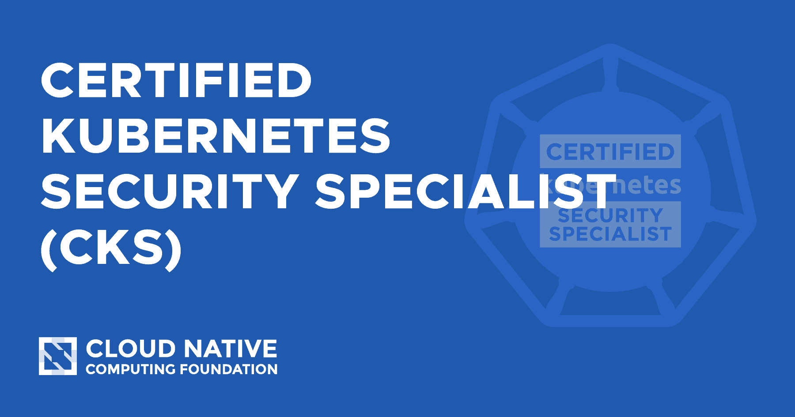
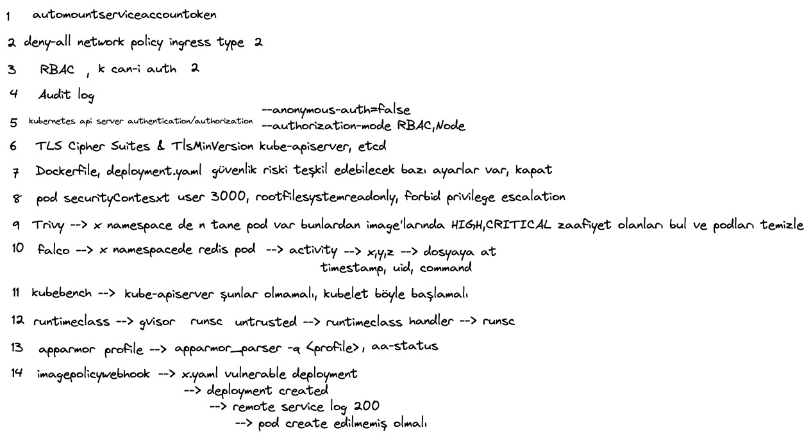

# Certified Kubernetes Security Specialist Hakkında Bilmeniz Gerekenler

## Description

- Hosted by [Batuhan Apaydın](https://github.com/developer-guy) (Senior Software Engineer at Trendyol)

- Event Date: 22/11/2022

- You can watch the episode recorded on [YouTube](https://youtu.be/q_z9jBEtjHQ)

### Summary

Bu etkinliğimizde yakın zamanda CKS sınavına giren Batuhan Apaydın, Certified Kubernetes Security Specialist sertifikasyonu hakkında sınava girmeden önce bilmemiz gerekenler hakkında merak ettiklerimizi cevaplandıracak.

## Table of Contents

- [Certified Kubernetes Security Specialist (CKS)](https://training.linuxfoundation.org/certification/certified-kubernetes-security-specialist/)

### Live Stream Recording

### Week in Review

- [CNCF Community Group](https://community.cncf.io/istanbul/)

### Show Notes

- [Kubernetes RBAC](https://kubernetes.io/docs/reference/access-authn-authz/rbac/)

- [Network Policies](https://kubernetes.io/docs/concepts/services-networking/network-policies/#default-deny-all-ingress-traffic)

- [Service Accounts](https://kubernetes.io/docs/tasks/configure-pod-container/configure-service-account/)

- [Audit](https://kubernetes.io/docs/tasks/debug/debug-cluster/audit/#log-backend)

- [Anonymous Requests](https://kubernetes.io/docs/reference/access-authn-authz/authentication/#anonymous-requests)

- [Authorization Modules](https://kubernetes.io/docs/reference/access-authn-authz/authorization/#authorization-modules)

- [Security Context](https://kubernetes.io/docs/tasks/configure-pod-container/security-context/)

- [Runtime Class](https://kubernetes.io/docs/concepts/containers/runtime-class/)

- [AppArmor](https://kubernetes.io/docs/tutorials/security/apparmor/)

- [Image Policy Webhook](https://kubernetes.io/docs/reference/access-authn-authz/admission-controllers/#imagepolicywebhook)
